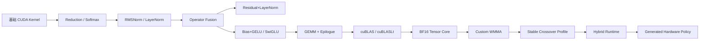
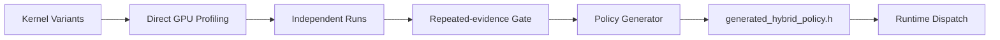

# CUDA Operator Lab

面向 Transformer 工作负载的 CUDA 算子优化、算子融合与 GPU Runtime 实验仓库。

这个项目不是“写几个 CUDA kernel 看谁快”，而是完整走了一遍 GPU 性能工程流程：

```text
PyTorch Reference
    ↓
Naive CUDA Baseline
    ↓
Correctness / Sanitizer
    ↓
CUDA Event Benchmark
    ↓
Bottleneck Analysis
    ↓
Shared Memory / Warp Shuffle / Vectorized IO / Fusion
    ↓
cuBLAS / cuBLASLt / Tensor Core / WMMA
    ↓
Stable Crossover Profiling
    ↓
Generated Hardware Policy
    ↓
Hybrid Runtime Dispatch
```

当前主线在 NVIDIA GeForce RTX 4090 Laptop GPU（Ada, SM 8.9）上验证，CUDA 12.8、PyTorch 2.10.0+cu128。最新完整测试：**816 passed**。

> 重点不是某一个“最快 kernel”，而是：如何用真实 benchmark 找瓶颈、隔离变量、保留负结果，并最终让 runtime 根据硬件与 shape 自动选择执行路径。

## 项目做了什么

仓库目前覆盖 8 条主要优化链。

| Case study | 优化路径 | 当前结论 |
|---|---|---|
| Reduction | serial → atomic → shared reduction → warp shuffle → float4 → shape dispatch | 大输入最终接近 PyTorch，瓶颈转为内存吞吐 |
| Softmax | serial row → block reduction → warp shuffle → width-aware → warp-per-row → dispatch | narrow-row packing 对高 row-count 有效，但不是全局最优 |
| RMSNorm | serial row → block reduction → warp shuffle → float4 → profile dispatch | float4 强依赖 shape，需要硬件 profile |
| LayerNorm | serial row → shared → warp shuffle → Welford → float4 → dispatch | 并行统计带来数量级提升；Welford 是数值实验而非默认最快路径 |
| Residual + LayerNorm | fused serial → block → warp → float4 → dispatch | “融合”只有和正确的并行/IO 策略结合才真正变快 |
| Bias + GELU | scalar fused → float4 → dispatch | pointwise fusion 本身就能消除中间 tensor / launch |
| SwiGLU | scalar fused → float4 → dispatch | 大工作集可从向量化获益，小 shape 需保守 |
| GEMM + Bias/GELU / SwiGLU | cuBLAS → cuBLASLt → BF16 TC → WMMA → hybrid runtime | 从 kernel tuning 进入 GEMM runtime / Tensor Core / policy engineering |

## 关键效果

以下均来自仓库中提交的真实 RTX 4090 Laptop benchmark；完整数据见 [最终性能报告](reports/final-performance.md)。

| 场景 | Baseline | 最终/代表实现 | 结果 |
|---|---:|---:|---:|
| Reduction, N=16,777,216 | V0 608,030.7 us | V5 168.1 us | **~3,618×** vs naive；约等于 PyTorch 170.0 us |
| Softmax, 128×4096 | V0 1,595.4 us | warp/block optimized ~14 us 级 | **>100×** vs serial baseline |
| RMSNorm, 128×8192 | V0 1,692.5 us | V4 12.0 us | **~140.7×** |
| LayerNorm, 128×4096 | V0 1,317.1 us | V5 17.3 us | **~75.9×** |
| Residual+LayerNorm, 128×4096 | V0 1,874.4 us | V4 23.2 us | **~80.8×** |
| Bias+GELU, 1024×4096 | PyTorch unfused 33.8 us | float4 fused 20.5 us | **~1.65×** |
| SwiGLU, 1024×4096 | PyTorch unfused 35.9 us | float4 fused 20.5 us | **~1.75×** |
| GEMM+SwiGLU, 512×4096×4096 | FP32 packed 2,246.7 us | BF16 Tensor Core 669.7 us | **~3.35×** |
| GEMM+SwiGLU, 128×64×2048 | cuBLAS BF16 17.2 us | hybrid custom WMMA 13.1 us | **~1.32×** |

这些数字不能被理解成“自定义 CUDA 永远比 PyTorch/cuBLAS 快”。恰恰相反，本项目的一个核心结论是：

- 小、launch-dominated workload：自定义 fused kernel / WMMA 可能更好；
- 大、throughput-dominated GEMM：cuBLAS/cuBLASLt 通常更强；
- 最好的工程实现往往是 **hybrid runtime**，而不是单一 kernel。

## 架构演进



### GEMM + SwiGLU

这是目前最完整的一条深度优化链：

```text
V0  two SGEMM + scalar SwiGLU
V1  two SGEMM + float4 post
V2  packed [2N,K] single GEMM
V3  packed GEMM + float4 post
V4  BF16 Tensor Core cuBLAS
V5  BF16 workspace experiment
V6  custom fused WMMA baseline
V7  shared-A WMMA reuse
V8  shared A+B staging      ← negative result
V9  8-way A reuse
V10 hybrid WMMA / cuBLAS runtime
V11 generated hardware policy
```

V11 已经形成完整闭环：



当前 RTX 4090 Laptop 的生成策略来自 **120 个实测 shape × 2 个独立 run**：

```text
M <= 128
K <= 128
N <= 2048
+ WMMA alignment constraints
    -> custom V7

otherwise
    -> cuBLAS BF16 V4
```

换一块 GPU 时，不需要手改 CUDA kernel，只需重新运行 crossover profiler 并重新生成 policy。

## Benchmark 方法

项目没有用单次“最快时间”下结论。

### 计时

- CUDA Event 计时；
- warmup 后重复采样；
- 主要看 median，并保留 P95；
- PyTorch / cuBLAS 对照尽量预分配 output/workspace，避免把 allocator 开销伪装成 kernel 收益。

### Cache / GPU 状态

Reduction、Norm、dispatch 等关键决策使用过：

- 64 MiB / 128 MiB L2 eviction buffer；
- sample-level interleaving；
- variant order 交错/随机；
- 多轮 round median；
- 多 independent seed。

```text
V2, V3, V3, V2, ...
```

而不是：

```text
V2 x 100
then
V3 x 100
```

这样降低 cache、DVFS、boost、温度和测试顺序对结论的影响。

### Dispatch acceptance

典型策略不是“快过一次就启用”，而是：

```text
speedup >= 1.05x
in every independent run
```

未测 shape / 不稳定 shape 默认回退到安全 baseline。

## Correctness 与 CUDA 安全

核心路径同时验证：

- PyTorch reference / float64 reference；
- `torch.testing.assert_close`；
- empty / odd / boundary shapes；
- preallocated output；
- active non-default CUDA stream；
- alignment / scalar fallback。

CUDA Compute Sanitizer：

```text
memcheck
racecheck
synccheck
```

同时保存 ptxas 资源数据：

- registers / thread；
- shared memory / block；
- spill stores / loads。

例如项目曾通过 racecheck 找到 Softmax shared-buffer reuse 的同步错误，而不是只依赖“测试看起来算对”。

## 一条命令跑核心 Benchmark

先构建：

```bash
./scripts/build.sh
./scripts/test.sh
```

然后：

```bash
./scripts/benchmark_all.sh
```

默认运行一组代表 shape，并输出：

```text
benchmarks/results/final_suite/
├── reduction.csv
├── softmax.csv
├── rmsnorm.csv
├── layernorm.csv
├── fused_residual_layernorm.csv
├── fused_bias_gelu.csv
├── swiglu.csv
├── gemm_bias_gelu.csv
├── gemm_swiglu.csv
└── summary.md
```

也可以直接：

```bash
PYTHONPATH=$PWD/python python3 benchmarks/run_all.py
```

## 仓库结构

```text
cuda-operator-lab/
├── csrc/
│   ├── reduction/
│   ├── softmax/
│   ├── rmsnorm/
│   ├── layernorm/
│   ├── fused_residual_layernorm/
│   ├── fused_bias_gelu/
│   ├── swiglu/
│   ├── gemm_bias_gelu/
│   └── gemm_swiglu/
├── python/cuda_operator_lab/     # ctypes / PyTorch zero-copy bindings
├── tests/                        # correctness + boundary + stream tests
├── benchmarks/                   # benchmark / stable profile / policy generation
├── reports/data/                 # raw hardware measurements
├── reports/final-performance.md  # final performance summary
├── docs/engineering-log.md       # implementation-oriented record
├── docs/experiment-log.md        # chronological experiment ledger
└── scripts/
```

## 负结果也保留

仓库不会删除“不够快”的实验，因为它们解释了为什么最终实现是现在这样。

代表性例子：

- Welford LayerNorm：数值更稳，但 double accumulation 性能代价过大；
- float4：并非所有 shape 都更快；
- SwiGLU post-kernel vectorization：GEMM 主导时收益很小；
- BF16 workspace：只快 1–3%，却增加中间量化误差；
- WMMA shared A+B staging：更多 shared-memory reuse 反而严重退化；
- 8-warp tile：大 GEMM略改善，小 GEMM退化。

这些结果最终导向了 profile-guided / hybrid runtime，而不是“一种 kernel 统治所有 shape”。

## 环境

主要实测环境：

```text
GPU: NVIDIA GeForce RTX 4090 Laptop GPU
Architecture: Ada, SM 8.9
Driver: 580.178.04
CUDA compiler: 12.8.93
PyTorch: 2.10.0+cu128
L2 cache: 64 MiB
```

机器系统 `/usr/bin/nvcc` 较旧，因此仓库提供：

```bash
./scripts/bootstrap_cuda_toolkit.sh
```

用于从已有 CUDA 12.8 包组装项目本地 `.cuda-toolkit/`。

## 进一步阅读

- [最终性能总表](reports/final-performance.md)
- [完整实验流水账](docs/experiment-log.md)
- [工程实现记录](docs/engineering-log.md)
- [原始 benchmark 数据](reports/data/)

## 项目定位

这个仓库最终关注的是三个层次：

1. **Kernel optimization**：线程组织、shared memory、warp shuffle、vectorized IO；
2. **Operator / GEMM fusion**：减少 launch 与中间 materialization；
3. **Runtime optimization**：vendor library、自定义 Tensor Core kernel、autotune、hardware-specific dispatch。

最终目标不是证明“手写 CUDA 一定比库快”，而是建立一个可以复现、验证和部署的 GPU 性能工程流程。
